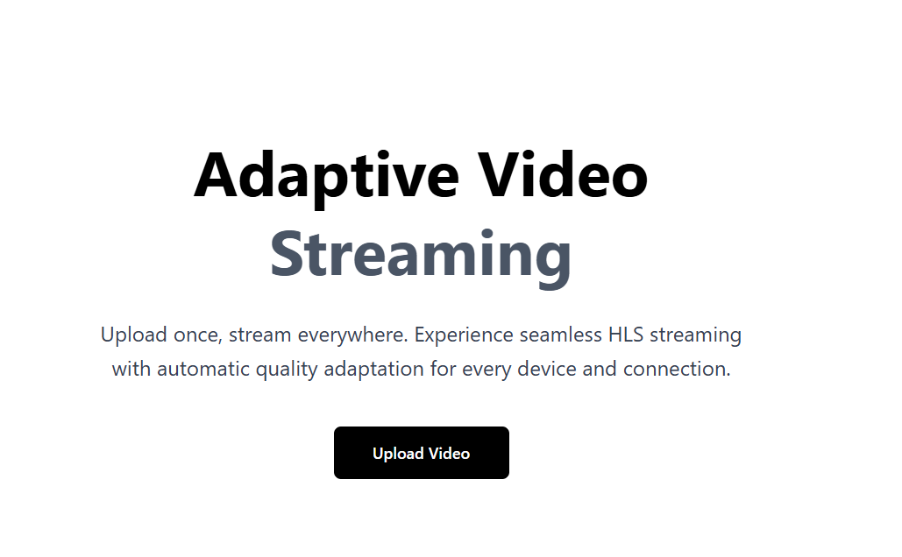
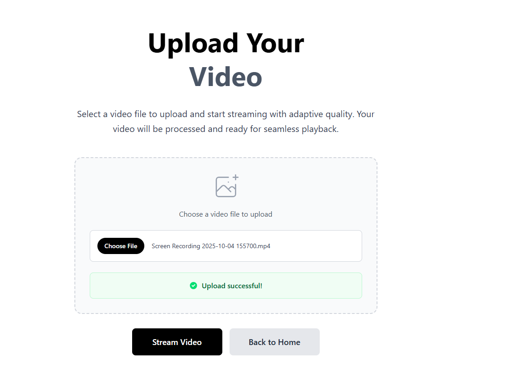
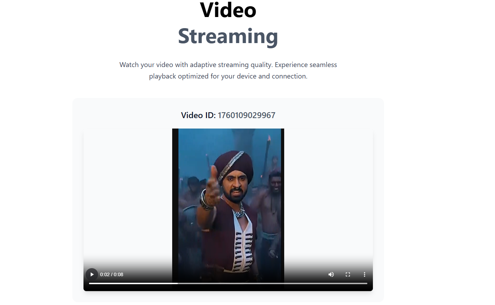

# Adaptive Video Streaming Application

A full-stack adaptive video streaming platform that enables users to upload videos and stream them with automatic quality adaptation based on network conditions. Built with modern web technologies, this application provides seamless video streaming experiences across different devices and connection speeds.

## What This Application Does

### Core Functionality

- **Video Upload & Processing**: Users can upload video files through an intuitive web interface
- **Adaptive Streaming**: Videos are automatically processed into multiple quality variants (360p, 480p, 720p, 1080p) using HLS (HTTP Live Streaming)
- **Quality Adaptation**: The streaming player automatically selects the best quality based on the user's network conditions
- **Real-time Processing**: Videos are processed asynchronously with status tracking
- **Cross-device Compatibility**: Works seamlessly across desktop and mobile devices

### User Workflow

1. **Upload**: Users select and upload video files through the web interface
2. **Processing**: Backend processes videos into multiple resolutions using FFmpeg
3. **Streaming**: Users can immediately start watching their videos with adaptive quality
4. **Optimization**: The system automatically adjusts video quality based on network conditions

## Technology Stack

### Backend Technologies

- **Node.js & TypeScript**: For robust server-side development with type safety
- **Express.js**: Lightweight web framework for REST API endpoints
- **FFmpeg & fluent-ffmpeg**: Industry-standard video processing library for transcoding
- **Prisma**: Modern database ORM for data management
- **MongoDB**: NoSQL database for storing video metadata and processing status
- **Multer**: File upload middleware for handling multipart/form-data

### Frontend Technologies

- **Next.js 15**: React framework with App Router for modern web development
- **React 19**: Latest React version with enhanced performance
- **TypeScript**: Type-safe frontend development
- **Tailwind CSS**: Utility-first CSS framework for responsive design
- **HLS.js**: JavaScript library for HTTP Live Streaming playback
- **Axios**: HTTP client for API communication

### Video Processing Pipeline

- **HLS (HTTP Live Streaming)**: Industry-standard adaptive streaming protocol
- **Multiple Resolutions**: 360p, 480p, 720p, and 1080p variants
- **Segment-based Streaming**: 10-second video segments for optimal buffering
- **Master Playlist**: Automatic quality selection based on bandwidth

## Challenges Faced

### Technical Challenges

1. **Video Processing Complexity**:

   - Implementing efficient FFmpeg transcoding for multiple resolutions
   - Managing asynchronous video processing without blocking the API
   - Handling large file uploads and processing times

2. **HLS Implementation**:

   - Creating proper master playlists for adaptive streaming
   - Ensuring cross-browser compatibility with HLS.js
   - Managing video segments and playlist generation

3. **State Management**:

   - Tracking video processing status across upload and transcoding
   - Handling errors during video processing
   - Providing real-time feedback to users

4. **File Management**:
   - Organizing processed video files and segments
   - Cleaning up temporary files after processing
   - Managing storage for multiple video variants

### Development Challenges

- **TypeScript Integration**: Ensuring type safety across the entire stack
- **Error Handling**: Implementing robust error handling for video processing failures
- **Performance Optimization**: Optimizing video processing for different file sizes and formats
- **Cross-platform Compatibility**: Ensuring consistent behavior across different operating systems

## Future Features & Improvements

### Planned Features

1. **User Authentication & Authorization**

   - User registration and login system
   - Video ownership and privacy controls
   - User-specific video libraries

2. **Enhanced Video Management**

   - Video thumbnails and previews
   - Video metadata editing (title, description, tags)
   - Video deletion and management interface

3. **Advanced Streaming Features**

   - Live streaming capabilities
   - Video analytics and viewing statistics
   - Subtitle and closed caption support

4. **Performance Optimizations**

   - CDN integration for global content delivery
   - Video compression optimization
   - Caching strategies for improved performance

5. **Mobile App Development**
   - React Native mobile application
   - Offline video downloading
   - Push notifications for processing completion

### Technical Improvements

- **Scalability**: Implement microservices architecture for better scaling
- **Cloud Integration**: Migrate to cloud storage (AWS S3, Google Cloud Storage)
- **Real-time Updates**: WebSocket integration for real-time processing status
- **Advanced Analytics**: Detailed video performance metrics
- **Security**: Implement proper authentication, authorization, and content protection

### Infrastructure Enhancements

- **Docker Containerization**: Containerized deployment for easier scaling
- **CI/CD Pipeline**: Automated testing and deployment
- **Monitoring**: Application performance monitoring and logging
- **Load Balancing**: Handle multiple concurrent video processing requests

## Getting Started

### Prerequisites

- Node.js (v18 or higher)
- MongoDB database
- FFmpeg installed on your system

### Installation

1. Clone the repository
2. Install backend dependencies: `cd backend && npm install`
3. Install frontend dependencies: `cd frontend && npm install`
4. Set up environment variables for MongoDB connection
5. Run the backend: `cd backend && npm run dev`
6. Run the frontend: `cd frontend && npm run dev`

The application will be available at `http://localhost:3000` for the backend API and `http://localhost:3001` for the frontend interface.
